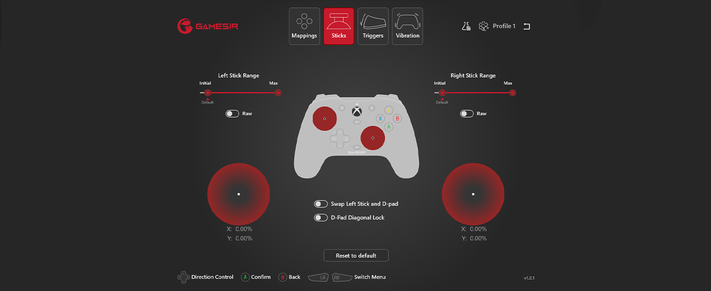

+++
title = 'GameSir G7 SE - O seu novo controle'
summary = 'Descubra a revolução no jogos com o controle GameSir G7 SE'
date = 2024-01-12
draft = false
tags = ["Controles", "Jogos"]

[cover]
image = 'thumb.jpeg'
hiddenInList = true
+++

O GameSir G7 SE impressiona primeiramente pelo seu design ergonômico e confortável. Inspirado no controle oficial do Xbox, ele oferece uma experiência de uso familiar para os jogadores. A leveza do controle (221 gramas) é um ponto positivo, especialmente para sessões de jogo prolongadas. O D-Pad, um componente frequentemente negligenciado em outros controles, recebe atenção especial no G7 SE, proporcionando uma resposta tátil precisa e agradável. Este foco no conforto e na usabilidade faz do G7 SE uma escolha acertada para diversos tipos de jogadores.

### Os Joysticks Hall Effect

A tecnologia Hall Effect é o coração do GameSir G7 SE. Os joysticks e gatilhos utilizam sensores magnéticos, uma abordagem que reduz significativamente o desgaste e o temido "drift" encontrado em outros controles. Esta tecnologia assegura uma experiência de jogo suave e precisa, essencial em jogos que requerem movimentos rápidos e precisos. A durabilidade aumentada dos joysticks é um grande atrativo, prometendo uma vida útil mais longa ao controle.

### Personalização e Funcionalidades Adicionais

Um aspecto notável do G7 SE é sua alta capacidade de personalização. Os botões traseiros mapeáveis permitem aos jogadores configurar o controle de acordo com suas preferências e necessidades específicas. Essa personalização é aprimorada pela capacidade de armazenar até três perfis diferentes, uma característica particularmente atraente para jogadores que alternam entre vários jogos ou estilos de jogo. Além disso, o controle oferece uma resposta de vibração impressionante, adicionando uma dimensão extra à experiência de jogo.

### Conexão Estável e Compatibilidade

O G7 SE é um controle com fio, o que garante uma conexão estável e elimina preocupações com a carga da bateria. A utilização de um cabo USB-C destacável é prática e oferece flexibilidade. Embora a falta de conectividade sem fio possa ser vista como uma desvantagem por alguns, para muitos jogadores a conexão direta é sinônimo de confiabilidade e resposta rápida. Sua compatibilidade com Xbox Series X|S, Xbox One e PCs Windows o torna uma escolha versátil para uma ampla gama de plataformas de jogo.

### Construção Sólida e Durável

A durabilidade é um aspecto crucial para qualquer controle de jogo, e o G7 SE não decepciona. Sua construção sólida resiste bem ao uso intenso, um fator essencial para jogadores que dedicam muitas horas aos seus jogos favoritos. A qualidade do material utilizado no controle contribui não apenas para sua resistência, mas também para uma sensação premium ao toque. Detalhes como a ausência de rangidos ou folgas quando pressionado ou torcido reforçam a impressão de um produto bem construído.

### Conclusão

Em resumo, o GameSir G7 SE se destaca como uma excelente opção para jogadores que buscam um controle acessível, durável e com tecnologia de ponta. Seu design ergonômico, personalização avançada e a tecnologia Hall Effect nos joysticks e gatilhos o tornam uma escolha sólida no mercado de controles. Para aqueles interessados em adquirir o GameSir G7 SE, ele está a venda na [Amazon](https://amzn.to/4aVuBY5).
